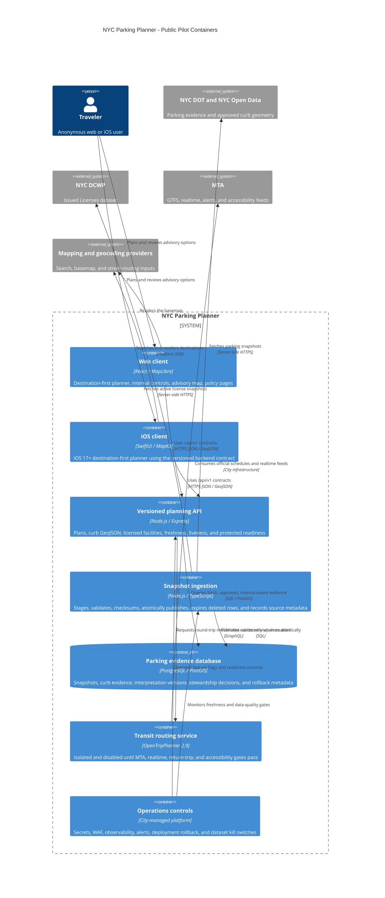

# Container diagram

```mermaid
C4Container
title NYC Parking Planner - Public Pilot Containers

Person(traveler, "Traveler", "Anonymous web or iOS user")

System_Ext(citydata, "NYC DOT and NYC Open Data", "Parking evidence and approved curb geometry")
System_Ext(dcwp, "NYC DCWP", "Issued Licenses dataset")
System_Ext(mta, "MTA", "GTFS, realtime, alerts, and accessibility feeds")
System_Ext(mapping, "Mapping and geocoding providers", "Search, basemap, and street-routing inputs")

System_Boundary(planner, "NYC Parking Planner") {
  Container(web, "Web client", "React / MapLibre", "Destination-first planner, interval controls, advisory map, policy pages")
  Container(ios, "iOS client", "SwiftUI / MapKit", "iOS 17+ destination-first planner using the versioned backend contract")
  Container(api, "Versioned planning API", "Node.js / Express", "Plans, curb GeoJSON, licensed facilities, freshness, liveness, and protected readiness")
  Container(ingestion, "Snapshot ingestion", "Node.js / TypeScript", "Stages, validates, checksums, atomically publishes, expires deleted rows, and records source metadata")
  ContainerDb(postgis, "Parking evidence database", "PostgreSQL / PostGIS", "Snapshots, curb evidence, interpretation versions, stewardship decisions, and rollback metadata")
  Container(otp, "Transit routing service", "OpenTripPlanner 2.9", "Isolated and disabled until MTA, realtime, return-trip, and accessibility gates pass")
  Container(ops, "Operations controls", "City-managed platform", "Secrets, WAF, observability, alerts, deployment rollback, and dataset kill switches")
}

Rel(traveler, web, "Plans and reviews advisory options")
Rel(traveler, ios, "Plans and reviews advisory options")
Rel(web, api, "Uses /api/v1 contracts", "HTTPS JSON / GeoJSON")
Rel(ios, api, "Uses /api/v1 contracts", "HTTPS JSON / GeoJSON")
Rel(web, mapping, "Renders the basemap")
Rel(ios, mapping, "Searches and renders destinations", "Platform SDK")
Rel(api, postgis, "Queries fresh, approved, interval-aware evidence", "SQL / PostGIS")
Rel(ingestion, citydata, "Fetches parking snapshots", "Server-side HTTPS")
Rel(ingestion, dcwp, "Fetches active license snapshots", "Server-side HTTPS")
Rel(ingestion, postgis, "Publishes validated snapshots atomically", "SQL")
Rel(api, otp, "Requests round-trip multimodal routes only when enabled", "GraphQL")
Rel(otp, mta, "Consumes official schedules and realtime feeds", "City infrastructure")
Rel(ops, api, "Operates feature flags and readiness controls")
Rel(ops, ingestion, "Monitors freshness and data-quality gates")
```

The clients never call MTA directly and never fall back to client-side parking-rule interpretation.
