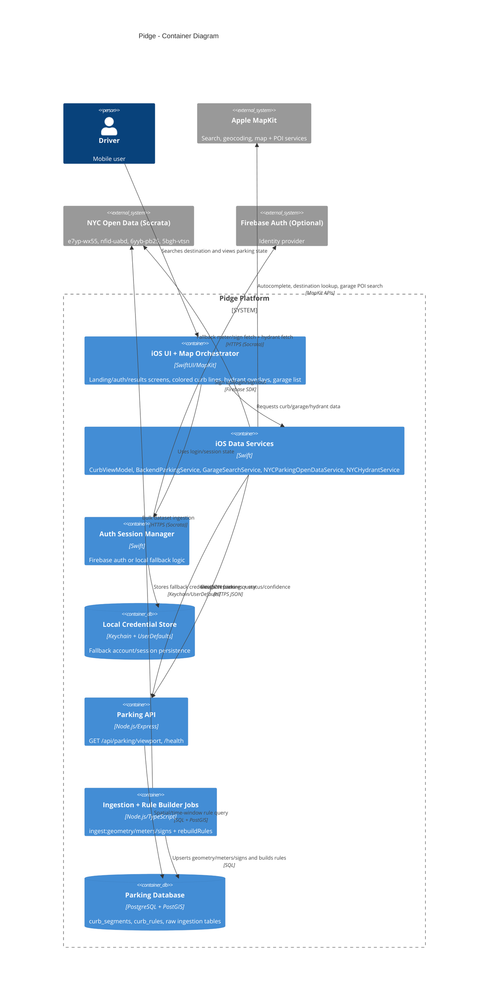

# Container Diagram

```mermaid
C4Container
title Pidge - Container Diagram

Person(driver, "Driver", "Mobile user")

System_Ext(mapkit, "Apple MapKit", "Search, geocoding, map + POI services")
System_Ext(nyc, "NYC Open Data (Socrata)", "e7yp-wx55, nfid-uabd, 6yyb-pb25, 5bgh-vtsn")
System_Ext(firebase, "Firebase Auth (Optional)", "Identity provider")

System_Boundary(pidge, "Pidge Platform") {
  Container(ios_ui, "iOS UI + Map Orchestrator", "SwiftUI/MapKit", "Landing/auth/results screens, colored curb lines, hydrant overlays, garage list")
  Container(ios_data, "iOS Data Services", "Swift", "CurbViewModel, BackendParkingService, GarageSearchService, NYCParkingOpenDataService, NYCHydrantService")
  Container(ios_auth, "Auth Session Manager", "Swift", "Firebase auth or local fallback logic")
  ContainerDb(local_store, "Local Credential Store", "Keychain + UserDefaults", "Fallback account/session persistence")

  Container(api, "Parking API", "Node.js/Express", "GET /api/parking/viewport, /health")
  Container(etl, "Ingestion + Rule Builder Jobs", "Node.js/TypeScript", "ingest:geometry/meters/signs + rebuildRules")
  ContainerDb(pg, "Parking Database", "PostgreSQL + PostGIS", "curb_segments, curb_rules, raw ingestion tables")
}

Rel(driver, ios_ui, "Searches destination and views parking state")
Rel(ios_ui, ios_data, "Requests curb/garage/hydrant data")
Rel(ios_ui, ios_auth, "Uses login/session state")
Rel(ios_auth, firebase, "Sign up/login/sign out", "Firebase SDK")
Rel(ios_auth, local_store, "Stores fallback credentials/session", "Keychain/UserDefaults")

Rel(ios_data, mapkit, "Autocomplete, destination lookup, garage POI search", "MapKit APIs")
Rel(ios_data, api, "Viewport parking query", "HTTPS JSON")
Rel_Back(api, ios_data, "GeoJSON features + status/confidence")

Rel(ios_data, nyc, "Fallback meter/sign fetch + hydrant fetch", "HTTPS (Socrata)")
Rel(etl, nyc, "Bulk dataset ingestion", "HTTPS (Socrata)")
Rel(etl, pg, "Upserts geometry/meters/signs and builds rules", "SQL")
Rel(api, pg, "Spatial/time-window rule query", "SQL + PostGIS")
```

