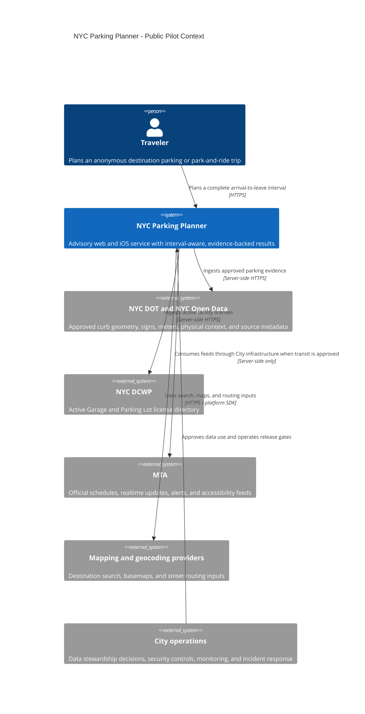

# Context diagram

```mermaid
C4Context
title NYC Parking Planner - Public Pilot Context

Person(traveler, "Traveler", "Plans an anonymous destination parking or park-and-ride trip")
System(planner, "NYC Parking Planner", "Advisory web and iOS service with interval-aware, evidence-backed results")
System_Ext(citydata, "NYC DOT and NYC Open Data", "Approved curb geometry, signs, meters, physical context, and source metadata")
System_Ext(dcwp, "NYC DCWP", "Active Garage and Parking Lot license directory")
System_Ext(mta, "MTA", "Official schedules, realtime updates, alerts, and accessibility feeds")
System_Ext(mapping, "Mapping and geocoding providers", "Destination search, basemaps, and street routing inputs")
System_Ext(operations, "City operations", "Data stewardship decisions, security controls, monitoring, and incident response")

Rel(traveler, planner, "Plans a complete arrival-to-leave interval", "HTTPS")
Rel(planner, citydata, "Ingests approved parking evidence", "Server-side HTTPS")
Rel(planner, dcwp, "Ingests active facility licenses", "Server-side HTTPS")
Rel(planner, mta, "Consumes feeds through City infrastructure when transit is approved", "Server-side only")
Rel(planner, mapping, "Uses search, maps, and routing inputs", "HTTPS / platform SDK")
Rel(operations, planner, "Approves data use and operates release gates")
```
