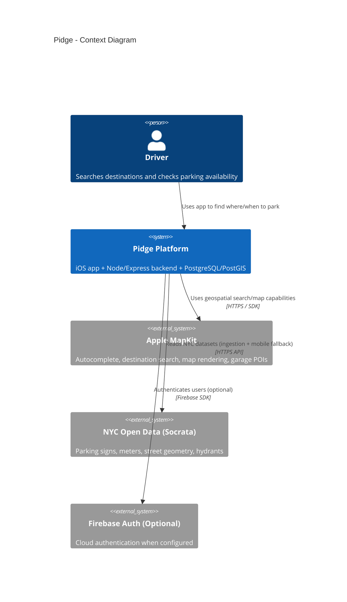

# Context Diagram

```mermaid
C4Context
title Pidge - Context Diagram

Person(driver, "Driver", "Searches destinations and checks parking availability")
System(pidge, "Pidge Platform", "iOS app + Node/Express backend + PostgreSQL/PostGIS")
System_Ext(mapkit, "Apple MapKit", "Autocomplete, destination search, map rendering, garage POIs")
System_Ext(nyc, "NYC Open Data (Socrata)", "Parking signs, meters, street geometry, hydrants")
System_Ext(firebase, "Firebase Auth (Optional)", "Cloud authentication when configured")

Rel(driver, pidge, "Uses app to find where/when to park")
Rel(pidge, mapkit, "Uses geospatial search/map capabilities", "HTTPS / SDK")
Rel(pidge, nyc, "Reads NYC datasets (ingestion + mobile fallback)", "HTTPS API")
Rel(pidge, firebase, "Authenticates users (optional)", "Firebase SDK")
```

